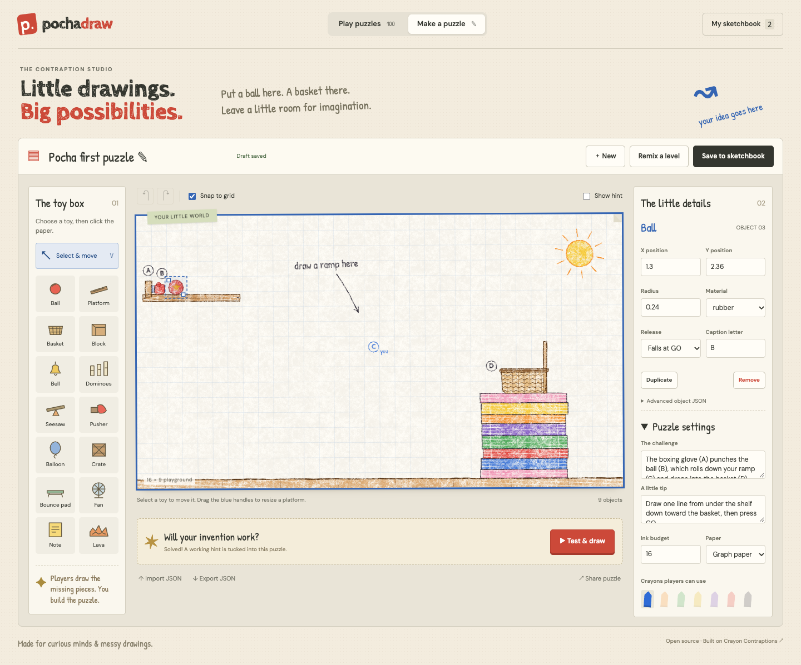

# Pochadraw ✎

A browser game for little drawings and big possibilities. Play 100 crayon physics puzzles, then make your own in the visual Contraption Studio.

**[Play](https://0051-pochadraw.vercel.app/)** · **[Open the studio](https://0051-pochadraw.vercel.app/editor.html)** · [GitHub Pages mirror](https://confusionlab.github.io/0051-pochadraw/)



## Play

Draw the missing parts of a machine and press **GO**. Seven crayons have different physics: fixed ramps, falling weights, bouncing surfaces, floating objects, pinned pendulums, boosters and magnets. The campaign includes 100 puzzles across ten worlds, timed drawing challenges and bosses.

## Make

- Start with a blank puzzle, or remix any of the 100 campaign levels.
- Place balls, platforms, baskets, blocks, bells, dominoes, seesaws, pushers, balloons, crates, trampolines, fans, notes and lava.
- Select and drag objects. Drag platform endpoints to resize or rotate them. Edit other dimensions, angles, materials and mechanism settings in the inspector.
- Set the ink budget, choose player crayons and pick a paper background.
- Undo/redo edits. Drafts save automatically; **Save to sketchbook** keeps a named puzzle. Starting or loading another puzzle keeps your previous draft in the sketchbook.
- **Test & draw** uses the original game and physics. Complete the puzzle, then keep your winning drawing as a hint. The studio replays the drawing before accepting it.
- Export/import `.pochadraw.json` files or share a playable URL. Receivers can open the puzzle in the editor and remix it.

The game’s Levels button opens a shared workspace with **Levels** and **Studio** tabs. Browse campaign and saved puzzles in Levels; choose Edit or switch to Studio to build a puzzle. Both views share the game’s wood background, top bar and paper controls. Save status appears beside Save in Studio.

Custom puzzles, editor drafts and completed-level star progress save to a shared Convex workspace. Gameplay drawings, the selected level, sound preferences and tutorial state stay in browser storage and never upload or restore from the cloud. There is one workspace, with no authentication or user scoping. Browser storage caches saves offline; pending changes retry when the connection returns. Star saves keep the best score. Share links still contain the level itself. Export JSON for portable backups. Live puzzle hint capture is replay-checked; erasing during a live run may require drawing a fresh solution to record a reproducible hint.

## Run locally

Requires Node.js 22 or newer.

```sh
npm ci
npm run backend:dev # link your own Convex project for development
npm run dev
```

Open http://localhost:8851 for the game, or http://localhost:8851/editor.html for the studio.

```sh
npm run check   # JavaScript syntax
npm run typecheck # Convex TypeScript
npm test        # level format, sharing, crayon physics, all 100 campaign answers
npm run build   # static site in docs/ and dist/
node test/browser-smoke.js # browser integration checks (requires running dev server)
npm run test:cloud # cross-browser persistence, offline retry and best-star checks against this project's dev backend
```

Vercel builds `dist/` using `npm run build:vercel`, which deploys Convex before the frontend. Set `CONVEX_DEPLOY_KEY` with the production backend's key in Vercel's Production environment, and the development backend's key in Preview. Connect the GitHub repository for automatic deploys. Keep keys server-side; they are never bundled into the frontend. `cloud.json` contains only the public backend URL used for GitHub Pages and manual static builds; change it to your own deployment when forking. Local development reads `CONVEX_URL` from `.env.local`. Planck.js and the Convex client are bundled locally. Google Fonts are optional.

## Editor shortcuts

| Shortcut | Action |
| --- | --- |
| V / Escape | Select tool / clear selection |
| Arrow keys | Nudge selected object |
| Shift + arrows | Larger nudge |
| Delete / Backspace | Remove selected object |
| Ctrl/Cmd + D | Duplicate selected object |
| Ctrl/Cmd + Z | Undo |
| Ctrl/Cmd + Shift + Z | Redo |
| Ctrl/Cmd + S | Save to sketchbook |

The editor supports mouse, pen and touch. On a phone, landscape gives the drawing paper more room.

## Project layout

- `index.html`, `js/app.js`: original campaign plus custom puzzle play and editor integration.
- `editor.html`, `css/editor.css`, `js/editor.js`: visual studio and playtest UI.
- `js/level-kit.js`: validation, level geometry, share encoding and browser storage helpers.
- `convex/schema.ts`, `convex/workspace.ts`: the shared puzzle library, editor draft and completed-level progress.
- `tools/cloud-client.js`: cloud hydration, realtime sketchbook updates, browser migration and offline save queue.
- `js/sim.js`, `js/crayon.js`, `js/draw.js`, `js/audio.js`: physics, crayon rendering and sound.
- `js/levels.js`: the original 100 campaign puzzles and their known solutions.
- `tools/`: original campaign generation tools. Change campaign recipes in `tools/plan.js`, `tools/hand.js` or `tools/archetypes.js`, then run `node tools/gen.js`.
- `test/`: format/sharing regression tests and campaign/crayon physics checks.
- `vendor/`: bundled Planck.js 1.4.2.

## Credits and license

Based on **[Crayon Contraptions by winchxyz](https://github.com/winchxyz/crayon-contraptions)**. Pochadraw preserves its artwork, physics, audio, campaign and MIT notice, and adds the visual studio and custom puzzle workflow. Editor interaction ideas were inspired by Drawvity; its code is not included.

MIT. See [LICENSE](LICENSE) and [THIRD_PARTY_NOTICES.md](THIRD_PARTY_NOTICES.md).
